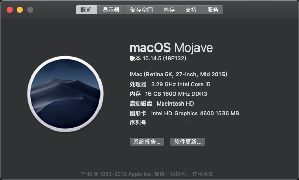
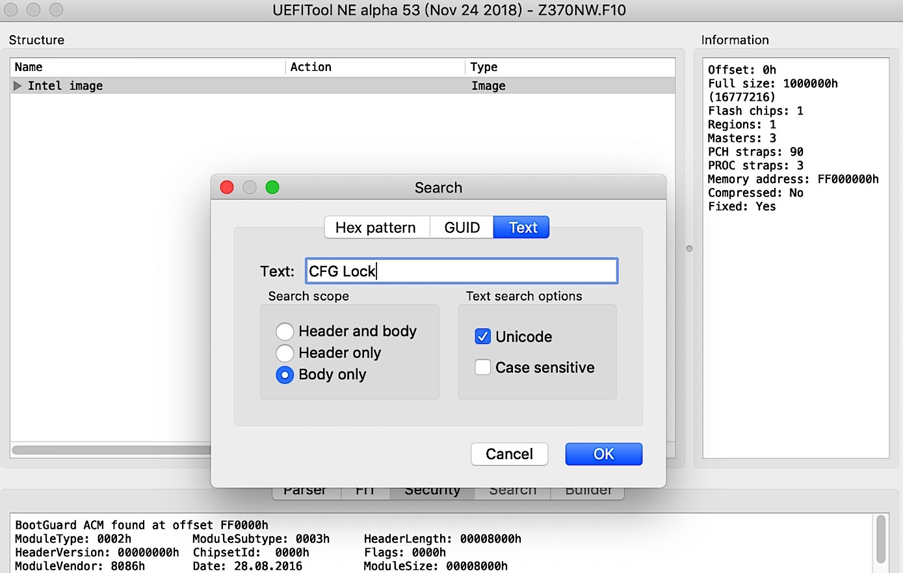
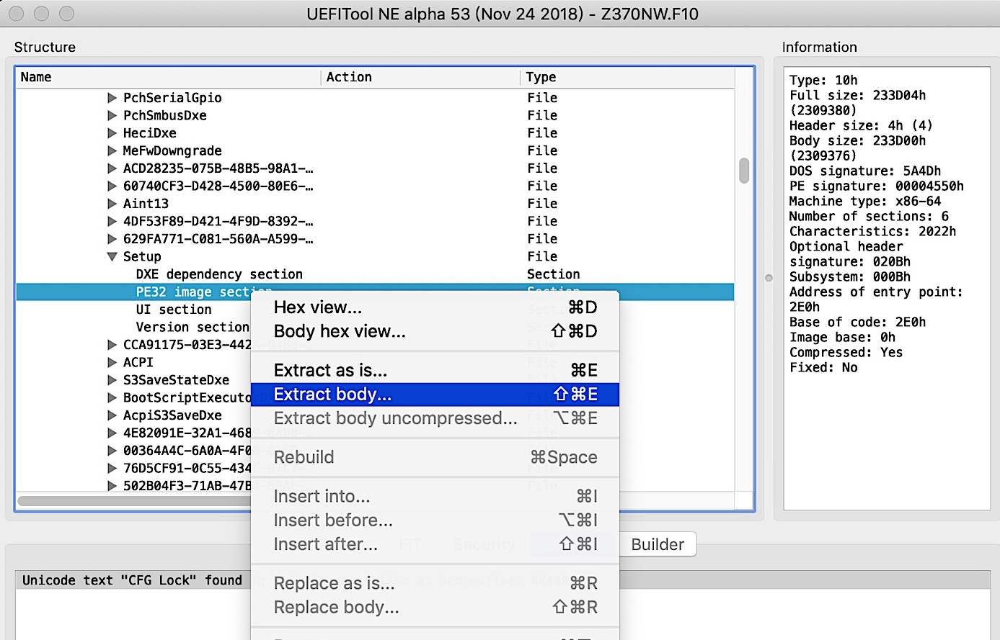
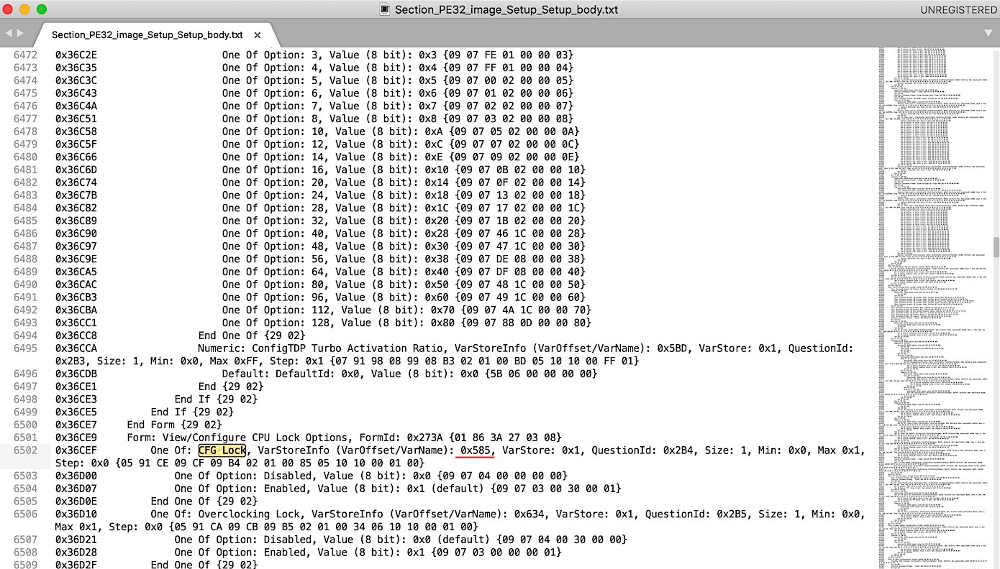

# Hackintosh for DELL OptiPlex 9020

## Todo

- Fix hibernation issues

- Smooth upgrade for macOS 10.15

## Usage

Copy files in EFI directory to your EFI partition.

## Fix BIOS issues

### General method (Windows recommanded)

- Download [BIOS Tools](bios_tools.zip).

- Fetch the address of block location.

    1. Use `BIOS_Backup_TooKit.exe` to fetch BIOS rom.

    2. Use `UEFITool` to open BIOS rom.

    3. Search keywords (cfg lock, DVMT), then Extract body.

    

    

    4. The output file is like `Section_PE32_image_Setup_Setup_body.efi`, use `IFR-Extractor` and command `./ifrextract Section_PE32_image_Setup_Setup_body.efi Section_PE32_image_Setup_Setup_body.txt` to convert it into text file.

    5. Open `Section_PE32_image_Setup_Setup_body.txt` and search keywords (cfg lock, DVMT) to find the closest addres behind it.

    

    6. Enter `GRUB Shell` (use `bootx64.efi` in `bios_tools.zip` to boot)

    7. Check address value by typing `setup_var [ADDR]`

    8. Typing `setup_var [cfg lock address here] 0x00` to disable cfg lock.

    9. Typing `setup_var [DVMT address here] 0x03` to increase DVMT to 96M.

### Easy for DELL OptiPlex 9020

Since I've already finished these steps above, just type the following command.

- Disable MSR 0xE2 (i.e. cfg lock) `setup_var 0xDA2 0x00`

- Increase DVMT to 96M `setup_var 0x263 0x03`

- You can check the value by typing `setup_var [ADDR]`

